# Spring Inversion of Control - Spring XML

## 1. Spring Container

* Primary Function
    * Create and Manage Objects (Inversion of Control)
    * Inject Object's dependencies (Dependency Injection)

## 2. Inversion of Control
* (Definition) The approach of **outsourcing the construction** and **management of objects**
    * outsource to an object factory

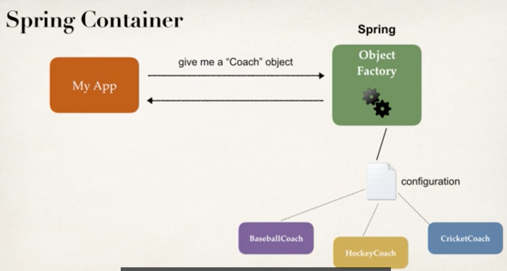

* Basically, use Spring Object Factory to create corresponding object

* Methods
    * XML configuration file (legacy, but most legacy apps still use this)
    * Java Annotations (modern)
    * Java Source Code (modern)

### 2.1 Spring Development Process
1. Configure your Spring Beans
```xml
<beans ...>
    <bean id="myCoach">
        <class="com.XXX">
    </bean<>>
</beans>
```

*
    * `bean id=myCoach` --> like an alias
    * `class="com.XXX"` --> fully qualified class name of implementation class

2. Create a Spring Container
    * Spring container is generally known as **Application Context**
    * Specialized Implementation
        * ClassPathXmlApplicationContext....etc

```java
ClassPathXmlApplicationContext context = new ClassPathXmlApplicationContext("applicationContext.xml");
```

3. Retrieve Beans from Spring Container
```java
Coach theCoach = context.getBean("myCoach", Coach.class);
```
(applicationContext.xml)
```xml
<bean id="myCoach">
    <class="com.luv2code.springdemo.BaseballCoach">
</bean>
```

* `myCoach` id to connectxml to getBean(...)
* `com.luv2code.springdemo.BaseballCoach` implementation class

## 2.2 Code
section4-inversionOfControl-SpringXML/src/main/java/HelloSpringApp.java

## 3. Dependency Injection
* Dependency Inversion Principle
    * The client delegates calls to another object the responsibility of providing its dependencies.


* Current Situation
    * Our Coach already provides daily workouts
    * Now, will also provide daily fortunes
        * New helper: FortuneService
        * This is a dependency

* Injection Types
    * Constructor Injection
    * Setter Injection

### 3.1 Development Process (Constructor Injection)

1. Define the dependency interface and class

```java
public interface FortuneService {
    public String getFortune();
}

public class HappyFortuneService implements FortuneService {
    public String getFortune() {
        return "Today is your lucky day";
    }
}
```

2. Create a constructor in your class for injections
```java
public class BaseballCoach implements Coach {
    private FortuneService FortuneService;

    public BaseballCoach(FortuneService theFortuneService) {
        fortuneService = theFortuneService;
    }
}
```

3. Configure the dependency injection in Spring config file
```xml
<!-- 1. Define dependency -->
<bean id="myFortuneService"
    class="com.luv2code.springdemo.HappyFortuneService">
</bean>

<!-- 2. Inject dependency using constructor injection -->
<bean id="myCoach"
    class="com.luv2code.springdemo.Baseballcoach">
    <constructor-arg ref="myFortuneService"/>
</bean>
```

**Behind the Scene**

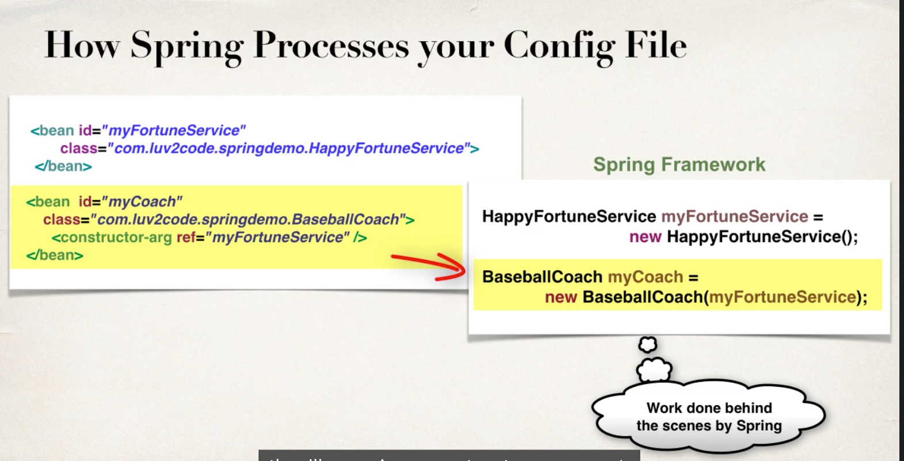

### 3.2 Development Process - Setter Injection

1. Create setter method(s) in your class for injections

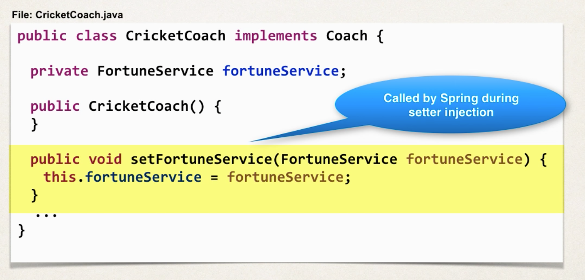

2. Configure the dependency injection in Spring config file

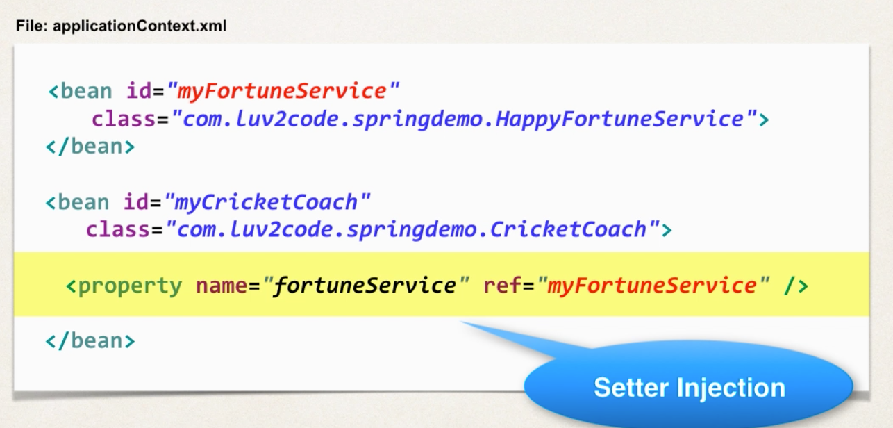


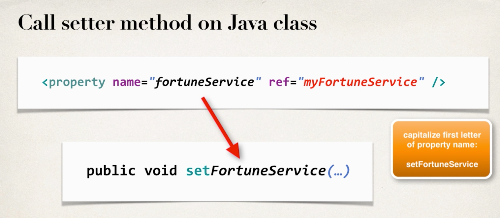

### 3.3 Injecting Literal Values

1. Create setter method(s) in your class for injections

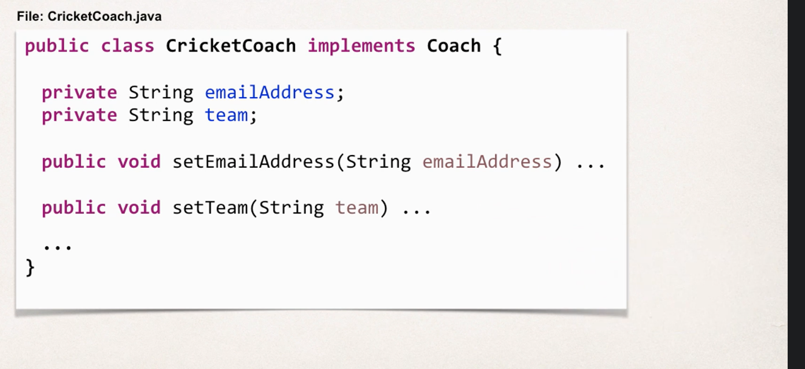

2. Configure the dependency injection in Spring config file

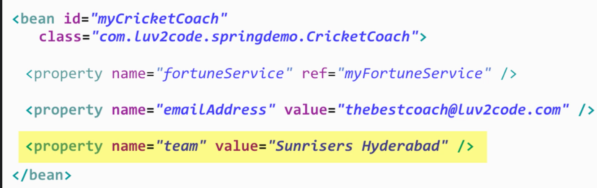

#### 3.3.1 Injection Values from a properties file

* Want to read literals (string) from a properties file
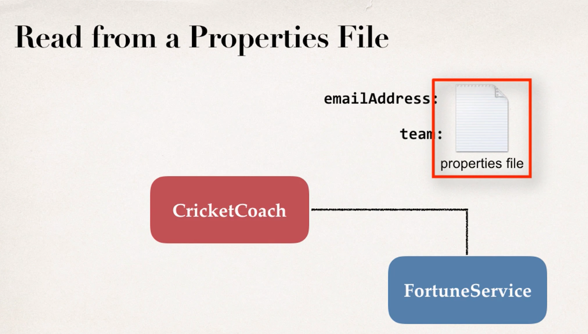


#### 3.3.2 Development Process

1. Create Properties File

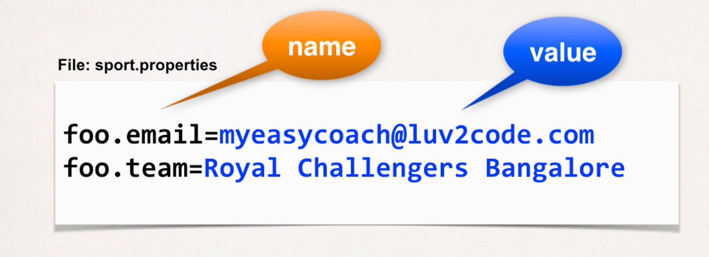


2. Load Properties File in Spring config file

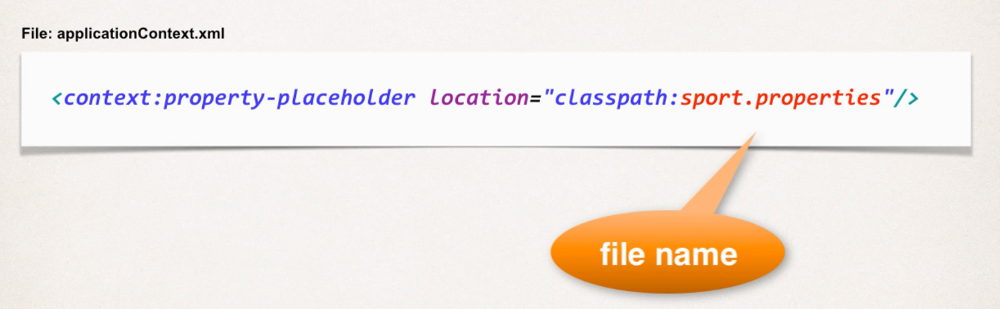

3. Reference values from Properties file

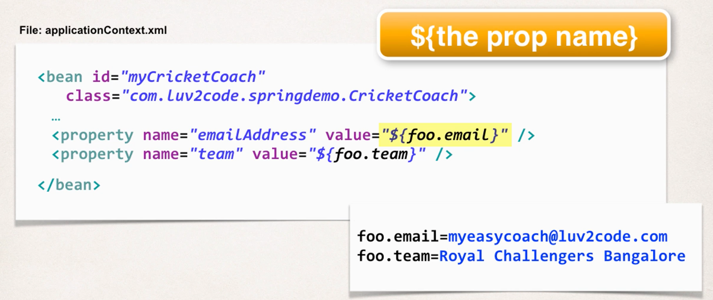
